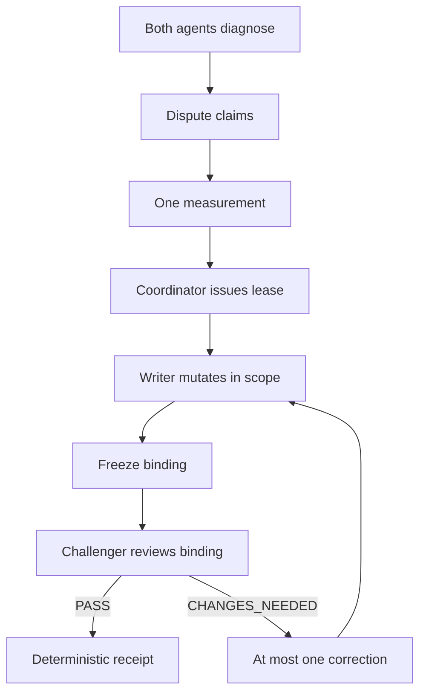

# Discepto

Discepto is a small Node.js reference implementation for testing whether a two-agent coding workflow follows explicit authority, evidence and review rules.

It replays synthetic event traces involving a coordinator, a writer and a read-only challenger. It rejects unauthorized mutations, self-issued leases, stale reviews and same-seat approval, then produces a deterministic receipt for the accepted trace.

Discepto does not launch agents, call AI models, edit Git repositories or claim to provide production safety. It isolates and tests the protocol layer behind those workflows.

## Why I built it

Two-agent coding workflows often mix coordination, mutation and review in one undifferentiated stream of tool calls. I wanted a narrow, offline way to pin those rules down: who may write, what evidence advances the run, and who may approve a freeze — without launching models or touching a real repository.

## How it works



## Example rejection

A writer attempts to issue their own lease. Discepto records `LEASE_ISSUER_MISMATCH`. The event does not alter accepted protocol state. A later coordinator-issued lease is accepted.

```json
{
  "code": "LEASE_ISSUER_MISMATCH",
  "operation": "lease",
  "message": "first lease must be coordinator-issued"
}
```

The rest of that adversarial trace continues: a coordinator lease, a writer mutation and freeze, rejected same-seat / writer-label reviews, then a challenger `PASS` on the bound freeze. Rejections are recorded; they do not change the freeze binding.

## Example receipt

Replaying `fixtures/adversarial-events.json` yields a deterministic receipt (trimmed):

```json
{
  "protocol_version": "discepto-protocol-4",
  "run_id": "run-neutral-001",
  "phase": "FINAL",
  "final": true,
  "current_freeze_id": "freeze-001",
  "freeze_binding": "98cca23c0ffea38e464e039420bfdfbb59105d6e5678cc3d46ed703c64bb86fc",
  "rejection_count": 4,
  "rejections": [
    { "code": "LEASE_ISSUER_MISMATCH", "operation": "lease" },
    { "code": "MUTATION_CHALLENGER", "operation": "mutation" },
    { "code": "REVIEW_REVIEWER_MISMATCH", "operation": "review" },
    { "code": "REVIEW_SAME_SEAT", "operation": "review" }
  ],
  "errors": [],
  "receipt_hash": "95afef4c6450b9025f3c41acec92dc8d105624f53dfe9844fc537b2772ac0e55"
}
```

## How to run it

Requires Node.js 22+.

```bash
npm ci --ignore-scripts
npm test
npm run validate
```

Replay any scenario and event trace:

```bash
node bin/discepto.mjs replay \
  --scenario ./examples/scenario.json \
  --events ./examples/events.json
```

JSON goes to stdout (compact by default; pass `--pretty` for indented output). Validation and usage errors go to stderr. The process exits non-zero on fatal validation or protocol errors, or when `--expected` does not match. Nonfatal authority rejections are part of a successful replay.

Bundled fixtures remain available:

```bash
npm run demo
npm run replay
npm run demo:adversarial
```

Cross-browser measurement (optional):

```bash
npx playwright install --with-deps chromium firefox webkit
npx playwright test
```

## Development note

Discepto was developed with extensive assistance from Claude Code and Codex. I defined the problem, protocol rules, safety boundaries and acceptance criteria; directed implementation; reviewed generated changes; and validated the result through adversarial fixtures, automated tests and repeated code-review passes.

## What this is not

This kit is **not** proven multi-agent orchestration, production safety certification, or evidence of real-world effectiveness. It is a synthetic protocol and replay reference. That limitation is intentional.

## Protocol

Protocol version `discepto-protocol-4`. Details live in [`docs/protocol.md`](docs/protocol.md).

- Two agents only: one predesignated writer, one read-only challenger, plus a coordinator id that issues leases
- Phases: DIAGNOSE → DISPUTE → MEASURE → IMPLEMENT → FREEZE → REVIEW → CORRECT → FINAL
- Prose and estimates never advance state; one discriminating measurement does
- Actor labels are schema-checked, not authenticated
- Fatal schema/phase errors stop replay; nonfatal authority rejections are recorded and replay continues
- Trace binding covers protocol version, run/coordinator/freeze IDs, recorded mutation paths, and a canonical measurement digest — not filesystem bytes
- Canonical JSON uses UTF-16 code-unit key order; changing the encoding requires a protocol-version increment

Public library surface ([`src/index.mjs`](src/index.mjs)):

```js
import {
  replayEvents,
  canonicalMeasurementHash,
  deriveFreezeBinding,
  PROTOCOL_VERSION,
} from './src/index.mjs';
```

## Optional watcher experiment

An optional experiment in [`experiments/watcher/`](experiments/watcher/) maps structured authority rejections into a deterministic review-policy classifier. It is a conformance exercise, not a trained model or real-world efficacy evaluation.

## Layout

- `src/protocol.mjs` — phase authority, lease rules, trace binding
- `src/schema.mjs` — structure and enum validation
- `src/canonical.mjs` — canonical JSON and SHA-256 helpers
- `src/cli.mjs` / `bin/discepto.mjs` — path-based replay CLI
- `src/replay.mjs` / `src/demo.mjs` — bundled-fixture helpers
- `src/adversarial-demo.mjs` — adversarial receipt to stdout
- `fixtures/` — synthetic scenario, events, expected state, adversarial trace
- `examples/` — documented CLI inputs (happy-path copies of the bundled fixtures)
- `playwright/` — neutral HTML fixture and cross-engine measurement spec
- `experiments/watcher/` — optional ordered-rules classifier
- `scripts/` — hardened git-archive release tooling
- `docs/` — protocol, methodology, and limitations

## License

Apache-2.0. See `LICENSE`.
